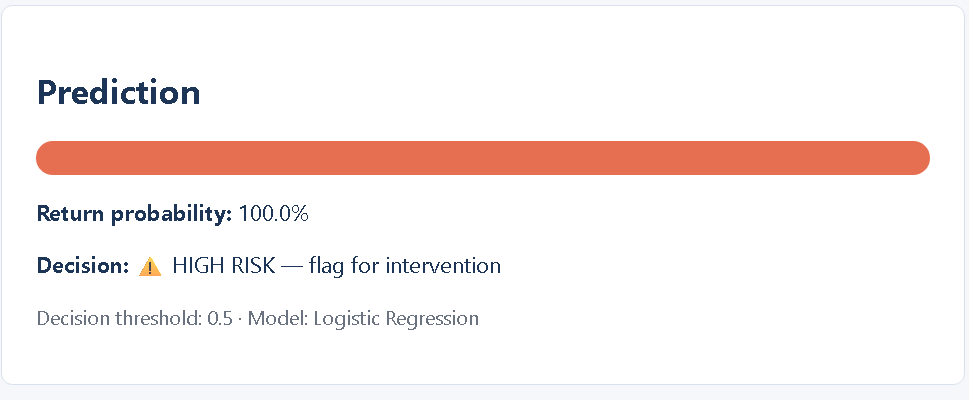

# 🛒 Product Return Prediction — Ibong and Sons



A production-ready ML service that predicts, **before an order ships**, whether
it will be returned. Built as a capstone project on a 12,000-order e-commerce
dataset.

**🔗 Live demo:** https://aideejames.github.io/product-return-prediction/  
**🔗 API docs:** https://product-return-prediction-thzn.onrender.com/docs

> ⏳ Backend runs on Render's free tier — the first request may take 30–60 seconds to wake up.

## Highlights

| | |
|---|---|
| **Model** | Logistic Regression (`class_weight='balanced'`) |
| **Recall (returned)** | **86.2%** — catches 4 of every 5 returns |
| **Precision** | 71.9% |
| **ROC-AUC** | 0.85 |
| **Features** | 85 (14 numeric, 4 binary, 67 one-hot) |
| **Training rows** | 9,597 (after leakage-safe outlier removal) |

## Why recall over accuracy

Missing a return costs a full refund + reverse-logistics; a false alarm costs
only a retention nudge. The business prioritises **recall** — the model catches
**86% of actual returns**.

## Stack

- **Backend:** FastAPI + Uvicorn
- **Frontend:** Vanilla HTML/CSS/JS
- **Model:** scikit-learn, serialised with `joblib`
- **Deployment:** Render (backend) + GitHub Pages (frontend)

## Project structure

```
.
├── backend/
│   ├── main.py               FastAPI app
│   ├── utils.py              Preprocessing (mirrors notebook)
│   ├── requirements.txt
│   └── artifacts/
│       └── model_data.joblib Trained bundle (model + scaler + metadata)
├── frontend/
│   ├── index.html
│   ├── style.css
│   └── script.js
├── docs/
│   └── screenshot.png
└── README.md
```

## Run locally

### 1. Backend

```bash
cd backend
pip install -r requirements.txt
python -m uvicorn main:app --reload
```

API docs at http://127.0.0.1:8000/docs

### 2. Frontend

Open `frontend/index.html` in a browser — it calls the local API.

## API

The API is deployed at:

**https://product-return-prediction-thzn.onrender.com**

### Interactive docs

👉 https://product-return-prediction-thzn.onrender.com/docs

Swagger UI — click **POST /predict** → **Try it out** → paste a payload → **Execute**.

### Call it from the terminal

```bash
curl -X POST https://product-return-prediction-thzn.onrender.com/predict \
  -H "Content-Type: application/json" \
  -d '{
    "product_category": "Electronics",
    "sub_category": "Laptops",
    "brand": "Brand_15",
    "product_price": 1402.90,
    "discount_percent": 30.6,
    "product_rating": 3.0,
    "review_count": 71,
    "fragile_item": 0,
    "warranty_available": 1,
    "product_return_rate": 0.183,
    "category_return_rate": 0.075,
    "brand_return_rate": 0.177,
    "defect_rate": 0.076,
    "seller_rating": 4.6,
    "seller_return_rate": 0.172,
    "fulfillment_type": "Marketplace Fulfilled",
    "payment_method": "Credit Card",
    "quantity": 4,
    "shipping_distance_km": 474.4,
    "delayed_delivery": 0,
    "wishlist_before_purchase": 0,
    "product_page_views": 12,
    "customer_support_calls": 0,
    "chat_interactions": 0
  }'
```

### Response

```json
{
  "return_probability": 0.741,
  "predicted_returned": 1,
  "threshold": 0.5,
  "model_name": "Logistic Regression"
}
```

### Endpoints

| Method | Path | Purpose |
|---|---|---|
| `GET` | `/` | API greeting + model name |
| `GET` | `/health` | Health check (also wakes a sleeping Render instance) |
| `GET` | `/model-info` | Model metrics + top-10 feature importances |
| `POST` | `/predict` | Predict return probability for a single order |

## Notebook

The full modelling notebook is at [`notebooks/product_return_prediction.ipynb`](notebooks/product_return_prediction.ipynb).

## License

MIT — see [LICENSE](LICENSE).